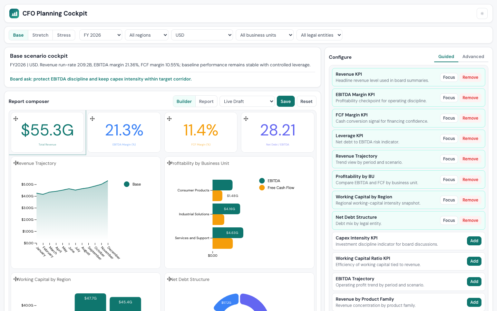

# CFO Planning Cockpit



Scenario-driven financial planning experience built on [Luzmo ACK](https://www.npmjs.com/package/@luzmo/analytics-components-kit) and Angular 17.

This showcase is intentionally wired to a public Luzmo dataset and does not pass any auth or embed token.

## Features

- **Scenario switching** — Base, Stretch, and Stress planning cases with context-aware board narrative
- **Global filters** — period, region, business unit, legal entity, and currency
- **Report composer** — 48-column grid with drag-and-drop repositioning and per-tile resize
- **Guided mode** — add/remove pre-configured KPI modules from a report library
- **Advanced mode** — configure data slots, switch chart types, edit styling
- **Version control** — save/restore named layout snapshots
- **Light and dark themes**

## Getting Started

1. Clone and install:

   ```bash
   git clone https://github.com/luzmo-official/flex-showcases.git
   cd flex-showcases/cfo-cockpit
   npm install
   ```

2. Start the dev server:

   ```bash
   npm start
   ```

   Open [http://localhost:3001](http://localhost:3001).

No `.env` file, injected globals, or token setup is required.

## Auth Model

This showcase does not pass `authKey`, `authToken`, or any embed token to ACK components.

It is designed to run as-is against the public CFO dataset so anyone copying the example can immediately see that no token exchange is part of the setup.

## Build

```bash
npm run build
```
